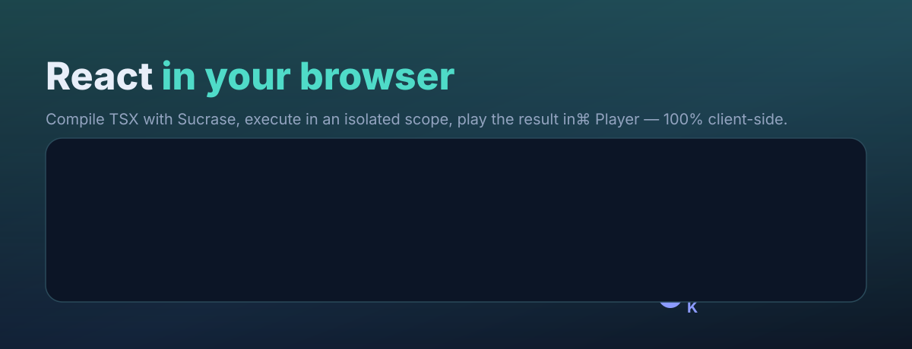
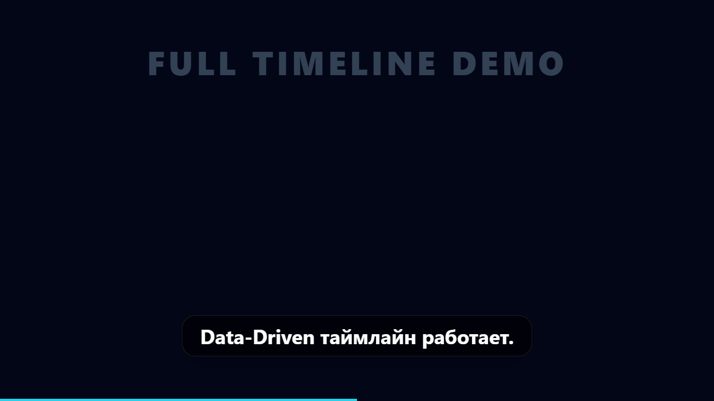
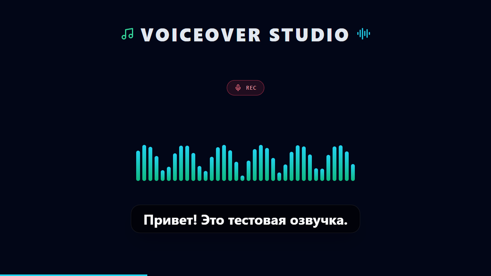
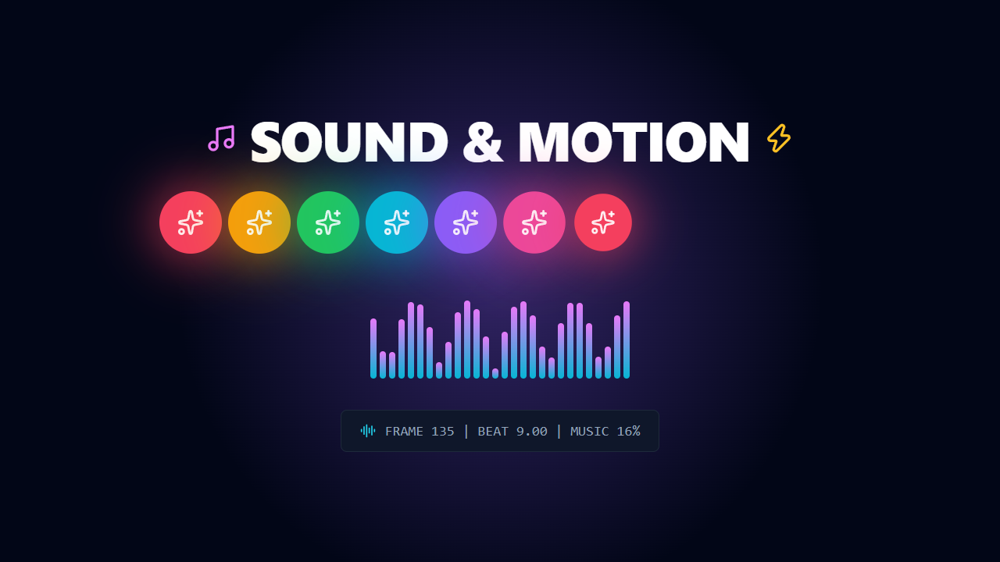
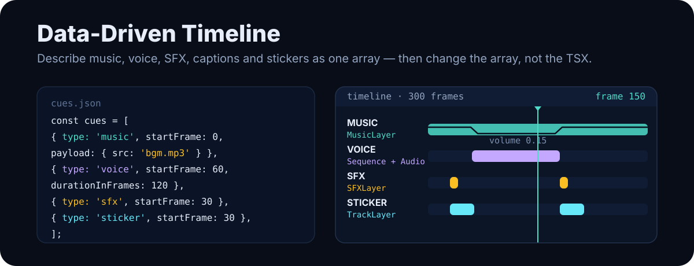
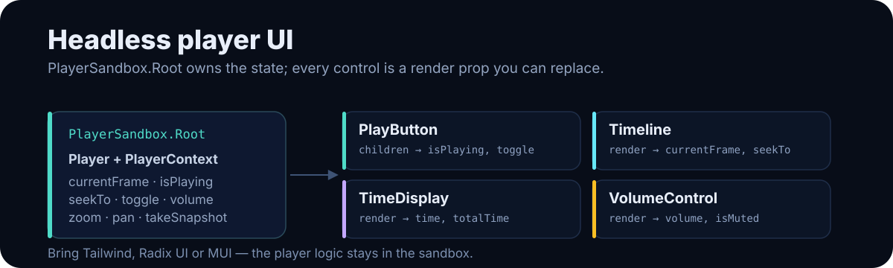
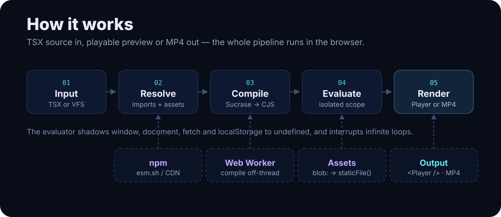

<div align="center">
  

  <p>
    <a href="https://www.npmjs.com/package/browser-tsx-sandbox"></a>
    
    
    
    
  </p>

  <p><b>Компилирует TSX и рендерит Remotion-видео прямо в браузере.</b><br>
  Без сервера и без сборки бандла: npm-зависимости тянутся с <code>esm.sh</code>, ассеты — через <code>blob:</code>, предпросмотр — в официальном <code>@remotion/player</code>.</p>
</div>

---

## Зачем это

Вы пишете или генерируете **TSX** (в редакторе, от ИИ, из JSON-каталога) — и получаете работающий React-компонент и настоящий видеопредпросмотр **прямо на клиенте**. Это ядро для браузерных видеоредакторов, AI-видеогенераторов и playground'ов, которым нельзя позволить себе серверный бандлинг.

- 🚀 **Zero-Backend** — компиляция, загрузка библиотек и рендер происходят в браузере.
- 📦 **NPM из коробки** — `import { motion } from 'framer-motion'` подгружается с CDN на лету.
- ▶️ **Живой Player** — одиночный вызов, полный Remotion-контекст (`useCurrentFrame`, `<Sequence>`).
- ⏱ **Data-Driven Timeline** — музыка, озвучка, SFX, субтитры и стикеры описываются JSON-массивом `Cue`.
- 🎨 **Headless UI** — примитивы плеера отдают состояние через *Render Props*: свой дизайн на Tailwind/Radix/MUI.
- 🧩 **Ассеты без сервера** — Drag & Drop медиа → `blob:` → `staticFile()`.
- 🛡️ **Устойчивость** — защита от бесконечных циклов, watchdog `delayRender`, ErrorBoundary, WebGL-guard.

---

## Реальный выхлоп

Кадры, отрендеренные пакетом в headless Chrome (скрипты `render:timeline`, `render:voiceover`, `render:animation`):

<p align="center">
  
  
  
</p>

Всё это — результат работы пайплайна песочницы, а не мокапы: `SandboxFacade` компилирует TSX, `executeComponent` выполняет его, а Remotion рендерит H.264 + AAC.

---

## Быстрый старт

```bash
npm install browser-tsx-sandbox react remotion @remotion/player
```

**Готовый UI-компонент** — один проп-объект:

```tsx
import { Sandbox } from 'browser-tsx-sandbox';

const code = `
  export default function Scene() {
    return <div style={{ color: '#4FDBC8', fontSize: 72 }}>Hello sandbox</div>;
  }
`;

<Sandbox config={{ code, className: 'rounded-xl overflow-hidden' }} />
```

**Живой видеоплеер** (subpath `browser-tsx-sandbox/player`):

```tsx
import { PlayerSandbox } from 'browser-tsx-sandbox/player';

<PlayerSandbox
  config={{
    code,
    durationInFrames: 300,
    fps: 30,
    width: 1920,
    height: 1080,
    controls: true,
    loop: true,
    renderLoading: () => <Spinner />,
    renderError: ({ error }) => <Banner text={error.message} />,
    onCompiled: ({ executionTimeMs }) => console.log(`compiled in ${executionTimeMs}ms`),
  }}
/>
```

---

## ⏱ Data-Driven Timeline



Слои описываются **единым массивом `Cue`**, а не хардкодом `<Sequence>` в TSX. Меняете массив в стейте — сцена обновляется без перекомпиляции.

```tsx
import { MusicLayer, SFXLayer, TrackLayer, useActiveCues, type Cue } from 'browser-tsx-sandbox';

const cues: Cue<any>[] = [
  { id: 'bgm',   type: 'music',   startFrame: 0,  payload: { src: 'bgm.mp3', volume: 0.8 } },
  { id: 'voice', type: 'voice',   startFrame: 60, durationInFrames: 120, payload: { src: 'voice.mp3' } },
  { id: 'sfx',   type: 'sfx',     startFrame: 30, payload: { src: 'pop.ogg' } },
  { id: 'cap',   type: 'caption', startFrame: 60, durationInFrames: 60, payload: { text: 'Привет!' } },
  { id: 'st',    type: 'sticker', startFrame: 30, durationInFrames: 80, payload: { x: '20%', icon: 'Zap' } },
];

export default function Scene() {
  // Audio Ducking: музыка затихает, пока звучит озвучка.
  const duck = (frame: number) => (frame >= 60 && frame <= 180 ? 0.15 : 1);
  const caption = useActiveCues(cues, 'caption')[0]?.payload?.text;

  return (
    <AbsoluteFill>
      <MusicLayer cues={cues} volumeDucking={duck} />
      <SFXLayer cues={cues} globalVolume={0.9} />
      <TrackLayer cues={cues} type="sticker" renderCue={(c) => <Sticker {...c.payload} />} />
      {caption ? <Caption text={caption} /> : null}
    </AbsoluteFill>
  );
}
```

| Слой | Что делает |
|---|---|
| `MusicLayer` | фоновая музыка с покадровым `volumeDucking` (Audio Ducking) |
| `SFXLayer` | оборачивает `type: 'sfx'` в `<Sequence><Audio /></Sequence>` |
| `TrackLayer` | универсальный визуальный трек: тайминг задаёт `<Sequence>`, контент — `renderCue` |
| `useActiveCues(cues, type?)` | события, активные на текущем кадре (субтитры, HUD) |

Готовые примеры: `examples/data-driven-timeline.tsx`, `examples/voiceover-animation.tsx`.

### Редактор без перекомпиляции

Держите `cues` в состоянии UI и подавайте через `inputProps` — `code` не меняется, а кадр обновляется:

```tsx
const [cues, setCues] = useState<Cue[]>([]);

<PlayerSandbox config={{
  code: SCENE_TSX,                       // не меняется
  modules: { remotion, 'browser-tsx-sandbox': Timeline },
  inputProps: { cues },                  // сцена читает cues из пропсов
  durationInFrames: 300, fps: 30,
}} />
```

---

## 🎨 Headless UI плеера



`PlayerSandbox.Root` хранит состояние в `PlayerContext`, а каждый примитив можно полностью заменить — логика остаётся внутри, разметку задаёте вы.

```tsx
import { PlayerSandbox, usePlayerContext } from 'browser-tsx-sandbox/player';
import { Play, Pause } from 'lucide-react';

<PlayerSandbox.Root config={{ code, durationInFrames: 300, fps: 30 }}>
  <div className="rounded-xl overflow-hidden"><PlayerSandbox /></div>

  <div className="flex items-center gap-4 bg-gray-900 p-4 rounded-xl">
    <PlayerSandbox.PlayButton>
      {({ isPlaying, toggle }) => (
        <button onClick={toggle} className="p-3 bg-blue-600 rounded-full text-white">
          {isPlaying ? <Pause size={20} /> : <Play size={20} />}
        </button>
      )}
    </PlayerSandbox.PlayButton>

    <PlayerSandbox.Timeline
      render={({ currentFrame, durationInFrames, seekTo }) => (
        <input type="range" className="flex-1" min={0} max={durationInFrames}
          value={currentFrame} onChange={(e) => seekTo(Number(e.target.value))} />
      )}
    />

    <PlayerSandbox.TimeDisplay
      render={({ time, totalTime }) => <span className="font-mono text-gray-400">{time} / {totalTime}</span>}
    />

    <PlayerSandbox.VolumeControl
      render={({ volume, isMuted, setVolume, toggleMute }) => (
        <input type="range" min={0} max={1} step={0.01} value={volume}
          onChange={(e) => setVolume(Number(e.target.value))} />
      )}
    />
  </div>
</PlayerSandbox.Root>
```

| Примитив | API | Контекст |
|---|---|---|
| `PlayButton` | `children`-функция | `{ isPlaying, toggle }` |
| `Timeline` | `render` | `{ currentFrame, durationInFrames, seekTo }` |
| `TimeDisplay` | `render` | `{ frame, totalFrames, time, totalTime, fps }` |
| `VolumeControl` | `render` | `{ volume, isMuted, setVolume, toggleMute }` |

Внутри `PlayerSandbox.Root` доступен и хук `usePlayerContext()` — для горячих клавиш и внешних контролов. Без render prop примитивы рендерят дефолтную разметку.

---

## 🎵 Аудио: музыка, озвучка, SFX

Звук собирается штатным `<Audio />` из Remotion: ассеты (MP3/WAV/OGG) загружаются пользователем, превращаются в `blob:` и передаются в `config.assets`.

```tsx
const assets = {
  'bgm.mp3': URL.createObjectURL(bgmFile),
  'voice.mp3': URL.createObjectURL(voiceFile),
};

<PlayerSandbox config={{ code, assets }} />
```

```tsx
import { Audio, Sequence, staticFile, useCurrentFrame, useVideoConfig, interpolate } from 'remotion';

export default function Scene() {
  const frame = useCurrentFrame();
  const { fps } = useVideoConfig();
  const bgmVolume = interpolate(frame, [45, 60, 180, 195], [0.8, 0.15, 0.15, 0.8],
    { extrapolateLeft: 'clamp', extrapolateRight: 'clamp' });

  return (
    <>
      <Audio src={staticFile('bgm.mp3')} volume={bgmVolume} />
      <Sequence from={60} durationInFrames={120}>
        <Audio src={staticFile('voice.mp3')} volume={1} />
      </Sequence>
    </>
  );
}
```

> `MusicLayer` использует тот же приём: Remotion `<Audio volume={(frame) => number}>` позволяет считать ducking покадрово.

---

## 🏗 Как это работает



1. **Input** — строка TSX или виртуальная файловая система (`files` + `entry`).
2. **Resolve** — `ImportResolver` ищет локальные файлы в VFS, недостающие npm-пакеты тянет с CDN, ассеты подменяет на `blob:`.
3. **Compile** — Sucrase транспилирует TSX → CommonJS (опционально в Web Worker).
4. **Evaluate** — `new Function` в изолированной области (`window`, `document`, `fetch`, `localStorage` затенены в `undefined`).
5. **Render** — компонент играет в `@remotion/player` или рендерится в MP4 офлайн (Node + Chrome).

### Возможности ядра

| Возможность | API |
|---|---|
| Компиляция TSX → CJS | `compileTsx`, `SucraseCompilerAdapter` |
| Оркестрация пайплайна | `SandboxFacade` (`compile`, `setAssets`, `registerModule`) |
| React-хук с debounce/abort | `useLiveSandbox` |
| Виртуальная ФС | `files` + `entry`, `resolveVfsPath`, `scanImports` |
| NPM с CDN | `loadMissingModules`, `defaultCdnResolver`, `defaultImporter` |
| Кэш модулей + IndexedDB | `ModuleCache` |
| Защита от зависаний | `injectLoopProtection`, `ExecutionTimeoutError` |
| Компиляция в воркере | `WorkerCompilerAdapter`, `createCompilerWorker` |
| Плагины пайплайна | `plugins: [{ beforeCompile, afterCompile }]` |
| Фазы ошибок | `getErrorPhase`, `ErrorPhase`, `CompilerError`… |
| Типы для Monaco/CodeMirror | `getSandboxTypeDefinitions` |
| ZIP-ассеты | `extractAssetZip`, `createAssetUrlMap`, `releaseAssetUrls` |

### Надёжность плеера (v0.4.0)

- **Smart Frame Retention** — при перекомпиляции сохраняются кадр и play (`smartFrameRetention`).
- **Императивный API** — `PlayerSandboxRef`: `seekTo`, `getCurrentFrame`, `play/pause/toggle`, `takeSnapshot`, `resetZoomPan`, `getActiveDelayHandles`, `getRemotionPlayerRef`.
- **delayRender Watchdog** — снимает зависшую блокировку кадра (`createRemotionWatchdog`).
- **WebGL Guard** — освобождает контексты при размонтировании (`cleanupCanvasWebGl`).
- **Snapshot** — PNG/JPEG текущего кадра прямо в браузере (`takeContainerSnapshot`).
- **Safe Zones** — `tiktok-9x16`, `reels-9x16`, `shorts-9x16`, `tv-safe-16x9`, `rule-of-thirds`, `center-cross`.
- **Studio Canvas** — `canvasControls: { zoom, pan }` (Ctrl+Wheel, Shift+Drag).

---

## 📦 Ассеты и внешние библиотеки

**ZIP-архив** медиа → карта `blob:`-ссылок:

```ts
import { extractAssetZip, createAssetUrlMap, releaseAssetUrls } from 'browser-tsx-sandbox';

const archive = extractAssetZip(zipBytes);
const urls = createAssetUrlMap(archive, (bytes) => URL.createObjectURL(new Blob([bytes])));
facade.setAssets(urls);            // staticFile('clip.mp4') → blob:
// ...
releaseAssetUrls(urls, URL.revokeObjectURL);
```

**Динамический npm** — просто импортируйте пакет в TSX; он подгрузится с `esm.sh` во время выполнения:

```tsx
import { motion } from 'framer-motion';   // esm.sh/framer-motion
import * as d3 from 'd3';                 // esm.sh/d3
import confetti from 'canvas-confetti';
```

Свой CDN или компилятор — через `cdnResolver`, `compiler`, `importer`.

---

## 🎬 Рендер видео (офлайн, Node + Chrome)

| Команда | Результат |
|---|---|
| `npm run render` | PNG-кадр + MP4 из сцены песочницы |
| `npm run render:assets` | сцена с медиа из ZIP (`OffthreadVideo` + `Img`) |
| `npm run render:example` | пример `examples/remotion-scene.tsx` |
| `npm run render:widgets` | виджеты из JSON-каталога |
| `npm run render:cdn` | d3/three, скачанные с esm.sh прямо в браузере |
| `npm run render:showcase` | Tailwind + lucide + d3/three в одной сцене |
| `npm run render:audio` | музыка + озвучка + Audio Ducking |
| `npm run render:animation` | ритм-анимация со скачанными музыкой и SFX |
| `npm run render:timeline` | Data-Driven Timeline из массива `Cue` |
| `npm run render:voiceover` | реальная озвучка `examples/voice/voice_01.wav` + музыка + SFX |

> Рендер в файл (`renderMedia`) — офлайн в Node + Chrome. В браузере доступен мгновенный предпросмотр через Player.

Демо: `npm run demo` (редактор + Player), `/studio.html` (Smart Frame Retention, snapshot, safe zones, зум, headless-тулбар).

---

## ✅ Тесты и качество

| Команда | Что проверяет |
|---|---|
| `npm test` | 165 юнит-тестов (компилятор, песочница, timeline, Player, примитивы) |
| `npm run test:e2e` | реальный рендер в Chrome: кадры, H.264 + AAC |
| `npm run test:network` | загрузка d3/three/canvas-confetti с esm.sh |
| `npm run typecheck` | `tsc --noEmit` |
| `npm run verify:video` | разбор MP4 (кодек, размеры, длительность) |

---

## 📖 Документация

- **[`API.md`](./API.md)** — полный справочник: `SandboxFacade`, `useLiveSandbox`, `<Sandbox>`, `<PlayerSandbox>`, headless-примитивы, Timeline, ассеты, ошибки, безопасность.
- **Демо-страницы** — `demo/index.html`, `demo/studio.html`.
- **Примеры** — `examples/`.

---

## ⚠️ Ограничения

- **Безопасность.** Затенение глобалов (`window`, `document`, `fetch`…) — защита от случайного и вредоносного доступа, но исполнение идёт в том же JS-realm: это не изоляция уровня ОС. Не запускайте непроверенный код без собственного sandbox-контура.
- **Сеть.** NPM-импорты и часть e2e требуют доступа к CDN. В Node нативные `https`-импорты не поддерживаются — тесты используют адаптер с `?bundle`.
- **`takeSnapshot`** для canvas-сцен (WebGL/2D) даёт настоящий PNG/JPEG; для чисто DOM-сцен браузер может пометить canvas как *tainted* и вернётся SVG data-URL.
- **Браузерный рендер в файл** невозможен — только офлайн (Node + Chrome) или предпросмотр в Player.

---

## 🛠 Разработка

```bash
npm install
npm test            # юнит-тесты
npm run test:e2e    # реальный рендер (нужен Chrome)
npm run typecheck
npm run build       # tsup → dist/ (ESM + CJS + d.ts)
npm run pack:check  # содержимое npm-тарбола
```

Публикуются только `dist/`, `README.md`, `API.md`. `react` — peer, `sucrase`/`fflate` — зависимости, `@remotion/player`/`remotion` — optional peer.

---

## License

[MIT](./package.json) © browser-tsx-sandbox
