Вот полная, подробная архитектурная документация (в формате `README.md`) для вашего проекта. Она полностью опирается на вашу Mermaid-диаграмму и детально описывает процесс динамической загрузки внешних библиотек из NPM прямо в браузере.

---

# 📦 browser-tsx-sandbox (Pro Edition)

**Полностью автономная In-Browser среда (Pure Client-Side App) для компиляции TSX, рендеринга видео через Remotion и динамической загрузки NPM-зависимостей.**

Эта архитектура позволяет создавать видеоредакторы и AI-генераторы видео, работающие на 100% в браузере пользователя, без использования Node.js бэкенда для сборки бандлов. 

## ✨ Ключевые возможности

- 🚀 **Zero-Backend:** Вся работа с файлами, компиляция кода и рендеринг происходят на клиенте.
- 📦 **Нативная поддержка NPM:** Динамический импорт любых библиотек (например, `framer-motion`, `d3`, `three.js`) напрямую с CDN (esm.sh / jsdelivr).
- 🎨 **Remotion + Tailwind:** Мгновенный рендеринг видеокадров и генерация служебных CSS-классов на лету (Tailwind JIT).
- 🧩 **Локальные ассеты:** Поддержка Drag & Drop медиафайлов через `Blob API` и `URL.createObjectURL` без загрузки на сервер.
- 🛡️ **Изоляция и Безопасность:** Безопасное выполнение сгенерированного ИИ кода (Shadowing глобальных переменных).
- 🪄 **Интеграция Lucide Icons:** Встроенный адаптер для поиска и рендеринга иконок без загрузки всей библиотеки целиком.
- 🧱 **Готовый UI-компонент:** `<Sandbox config={{ code, assets, modules, ... }} />` — импортируется и кастомизируется слотами (`render`, `renderLoading`, `renderError`, `wrapper`, `className`, `style`).
- ▶️ **Живой предпросмотр:** `<PlayerSandbox />` (subpath `browser-tsx-sandbox/player`) показывает результат в `@remotion/player` с play/pause/seek — без серверного рендера.

---

## 🚀 Быстрый старт (разработка)

Это **библиотечный пакет**, а не готовое приложение, поэтому у него нет `dev`-сервера — разработка идёт через тесты и проверку типов.

### 1. Требования
- Node.js 18+ (проект проверен на Node 24)
- npm

### 2. Установка зависимостей
```bash
npm install
```

### 3. Команды

| Команда | Что делает |
|---|---|
| `npm test` | один прогон всех тестов (Vitest) |
| `npm run test:watch` | тесты в режиме наблюдения (watch) |
| `npm run test:e2e` | e2e-тест реального рендера видео (Remotion + Chrome) |
| `npm run test:network` | сетевые тесты: реальная загрузка библиотек с esm.sh |
| `npm run render` | вручную отрендерить PNG-кадр и MP4 из сцены песочницы |
| `npm run render:assets` | то же, но с медиа-ассетами, распакованными из ZIP |
| `npm run render:example` | рендер реальной анимации из `examples/remotion-scene.tsx` |
| `npm run render:widgets` | рендер виджетов из JSON-каталога `examples/vidora-widgets.json` |
| `npm run render:widgets:logo` | рендер каталога `examples/vidora-widgets-logo.json` |
| `npm run render:props` | рендер вариаций пропсов (проверка, что параметры меняют результат) |
| `npm run render:cdn` | рендер сцены с библиотеками, скачанными с esm.sh в браузере |
| `npm run demo` | открыть demo-страницу с живым `<PlayerSandbox />` (Vite) |
| `npm run demo:build` | собрать статику demo-страницы в `demo/dist` |
| `npm run build` | сборка npm-пакета (`tsup` → `dist/`: ESM + CJS + типы) |
| `npm run pack:check` | `npm pack --dry-run` — показать содержимое тарбола |
| `npm run verify:video` | проверить выданный MP4 (контейнер, кодек, размеры, длительность) |
| `npm run typecheck` | статическая проверка типов (`tsc --noEmit`) |

### 4. Ручная проверка пайплайна

Песочницу можно прогнать на реальном файле `examples/remotion-scene.tsx`. Он компилируется из TSX в CommonJS, зависимости (`react`, `remotion`, `lucide-react`) подставляются заглушками, после чего сцена выполняется как React-компонент. Именно это проверяет интеграционный тест `src/facade.remotion.test.ts`:

```bash
npx vitest run src/facade.remotion.test.ts
```

### 5. Реальный рендер видео (Remotion)

Папка `render/` содержит настоящий e2e-пайплайн: сцена на TSX компилируется и выполняется через `SandboxFacade`, регистрируется как Remotion-композиция и рендерится в **PNG-кадр и MP4** через headless Chrome.

```bash
npm run render       # -> render/out/frame-30.png и render/out/sandbox.mp4
npm run test:e2e     # то же самое, но с проверками (размеры, наличие файлов)
```

Требуется установленный Google Chrome (или Edge). Путь ищется автоматически; при необходимости задайте свой:

```bash
$env:REMOTION_BROWSER="C:\путь\к\chrome.exe"; npm run render
```

> E2E-тест намеренно не входит в `npm test`: он бандлит Remotion-проект и запускает браузер, поэтому выполняется отдельно (~1 мин).

### 6. Ассеты из ZIP

Медиа-ресурсы (видео, картинки, шрифты, JSON) можно передать одним архивом. Библиотечная часть — `src/assets/zip.ts`: `extractAssetZip` распаковывает `Uint8Array` в карту байтов, `createAssetUrlMap` превращает её в `filename -> blob:url` для `SandboxFacade.setAssets`.

```ts
import { extractAssetZip, createAssetUrlMap, releaseAssetUrls } from 'browser-tsx-sandbox';

const archive = extractAssetZip(zipBytes); // { 'assets/clip.mp4': Uint8Array, ... }
const urls = createAssetUrlMap(archive, (bytes) => URL.createObjectURL(new Blob([bytes])));
facade.setAssets(urls); // теперь staticFile('clip.mp4') отдаёт blob:-ссылку
// ...
releaseAssetUrls(urls, URL.revokeObjectURL);
```

E2E-тест `render/assets.e2e.test.ts` кладёт реальный MP4 и SVG в ZIP, распаковывает их в `public` и рендерит сцену с `OffthreadVideo` + `Img` через Remotion `staticFile`:

```bash
npm run render:assets   # -> render/out/asset-still.png, render/out/asset-video.mp4
npm run test:e2e        # оба e2e-сценария (без ассетов и с ассетами)
```

### 7. Рендер анимации из `examples/`

`npm run render:example` берёт настоящий `examples/remotion-scene.tsx` (1177 кадров, 1920×1080) и проводит его через полный пайплайн:

1. находит в TSX абсолютные пути к видео и заменяет их на раздаваемые через `staticFile` (роль `ImportResolver`), копируя ролики в `public/b-roll/`;
2. компилирует Tailwind-утилиты из исходника на этапе сборки и инжектит их в сцену;
3. компилирует и выполняет сцену песочницей с реальными `react`, `remotion`, `lucide-react`;
4. рендерит по одному ключевому кадру каждого фрагмента и короткий клип.

```bash
npm run render:example
# -> render/out/example-frame-0075.png ... example-frame-1080.png
# -> render/out/example-map.mp4
```

E2E-тест: `render/example.e2e.test.ts`.

### 8. Виджеты из JSON-каталога

`examples/vidora-widgets.json` — экспорт каталога виджетов (`Vidora Motion Studio`): метаданные, `default_props` и встроенный `tsx_code`. `npm run render:widgets` парсит JSON и прогоняет **каждый** `tsx_code` через песочницу:

1. Tailwind-утилиты компилируются из `tsx_code` всех виджетов;
2. в Remotion-проекте каждый виджет компилируется (`compileTsx`), выполняется (`executeComponent`) и регистрируется как отдельная `Composition` с `default_props` (16:9 → 1920×1080, 9:16 → 1080×1920);
3. рендерятся ключевые кадры каждого виджета и короткий клип.

```bash
npm run render:widgets
# -> render/out/widget-WordByWordText16x9-*.png
# -> render/out/widget-WordByWordText9x16-*.png
# -> render/out/widget-WordByWordText16x9.mp4
```

E2E-тест: `render/widgets.e2e.test.ts`.

Второй каталог — `examples/vidora-widgets-logo.json` (Logo Shine Badge). Пропсы влияют на рендер, а `imageUrl` разбирается и встраивается как изображение. Проверяется тестом `render/props.e2e.test.ts`:

```bash
npm run render:widgets:logo   # дефолтные пропсы
npm run render:props          # вариации: текст/размер/цвет/иконка/картинка
```

> Полное описание всех контрактов и сигнатур — в [`API.md`](./API.md).

### 9. Пример использования на стороне потребителя

**Самый простой способ — готовый UI-компонент.** Один импорт, вся конфигурация в объекте-пропсе:

```tsx
import { Sandbox } from 'browser-tsx-sandbox';

function Preview({ userTsx, blobAssets }: { userTsx: string; blobAssets: Record<string, string> }) {
  return (
    <Sandbox
      config={{
        code: userTsx,
        assets: blobAssets,                 // staticFile('logo.png') -> blob:...
        className: 'rounded-lg overflow-hidden',
        style: { height: 480 },
        renderLoading: () => <Spinner />,
        renderError: ({ error }) => <Banner text={error.message} />,
        onCompiled: ({ executionTimeMs }) => console.log(`compiled in ${executionTimeMs}ms`),
      }}
    />
  );
}
```

`config` принимает:

| Поле | Тип | Описание |
|---|---|---|
| `code` | `string` | TSX для компиляции и рендера (обязательно) |
| `modules` | `ModuleRegistry` | Доступные модули (`react` добавляется автоматически) |
| `assets` | `Record<string, string>` | Карта ассетов для `staticFile(...)` (`blob:`/`data:`/`http`) |
| `importer` | `ModuleImporter` | Свой загрузчик npm-пакетов (по умолчанию esm.sh) |
| `className`, `style` | `string`, `CSSProperties` | Контейнер (включается, если заданы) |
| `wrapper` | `ComponentType<{children}>` | Обёртка вокруг готового компонента |
| `render` | `(ctx) => ReactNode` | Полный контроль над рендером |
| `renderLoading`, `renderError` | `(ctx) => ReactNode` | Кастомные состояния |
| `onCompiled`, `onError` | колбэки | Уведомления о результате |

**Низкоуровневые API** для полного контроля:

```tsx
import { useLiveSandbox, SandboxFacade } from 'browser-tsx-sandbox';
import * as React from 'react';

// 1) Хук
const { Component, error, isCompiling } = useLiveSandbox(code, {}, assets, {
  importer,
  onCompiled,
  onError,
});

// 2) Фасад (императивно)
const facade = new SandboxFacade({ react: React }, importer);
facade.setAssets(assets);
const { component: Compiled, error: compileError } = await facade.compile(code);
```

---

## 🏗 Архитектура системы

Ниже представлена полная схема взаимодействия подсистем (UI, State, Sandbox, Library Manager и Rendering Engine).

```mermaid
graph LR
    classDef ui fill:#2b6cb0,stroke:#3182ce,stroke-width:2px,color:#fff;
    classDef state fill:#38a169,stroke:#48bb78,stroke-width:2px,color:#fff;
    classDef core fill:#805ad5,stroke:#9f7aea,stroke-width:2px,color:#fff;
    classDef frontend fill:#dd6b20,stroke:#c05621,stroke-width:2px,color:#fff;
    classDef api fill:#319795,stroke:#4fd1c5,stroke-width:2px,color:#fff;
    classDef lib fill:#d69e2e,stroke:#ecc94b,stroke-width:2px,color:#fff;
    classDef error fill:#e53e3e,stroke:#f56565,stroke-width:2px,color:#fff;

    subgraph Browser ["Вкладка браузера (Pure Client-Side App)"]

        subgraph UI ["UI Layer"]
            CodeEditor["CodeEditor <br/> Monaco/CodeMirror"]:::ui
            PromptPanel["AI Prompt Panel <br/> generate/fix component"]:::ui
            SettingsEditor["Settings Editor <br/> fps, duration, theme"]:::ui
            AssetPanel["Asset Manager <br/> drag and drop, list, preview"]:::ui
            LibraryManager["Library Manager <br/> add/remove libraries"]:::ui
            IconPicker["Lucide Icon Picker <br/> search and insert icon"]:::ui
            StatusBar["Status Bar <br/> compiling, ready, error"]:::ui
        end

        subgraph State ["Application State"]
            ProjectStore["ProjectStore <br/> files, activeFile, code"]:::state
            SettingsStore["SettingsStore <br/> fps, duration, theme, props"]:::state
            AssetStore["AssetStore <br/> blobUrl, mime, size, map"]:::state
            LibraryStore["LibraryStore <br/> installed libs, versions, enabled"]:::state
            LucideCatalog["LucideCatalog <br/> icon names, tags"]:::state
            SandboxState["SandboxState <br/> compile status, error"]:::state
        end

        subgraph Sandbox ["browser-tsx-sandbox"]
            SandboxFacade["SandboxFacade <br/> orchestrate compile and evaluate"]:::core
            ImportResolver["ImportResolver <br/> resolve local files, assets, bare imports"]:::core
            SyntaxChecker["SyntaxChecker <br/> parse TSX AST"]:::core
            Compiler["SucraseCompiler <br/> TSX to CommonJS"]:::core
            ModuleCache["ModuleCache <br/> compiled module registry"]:::core
            DependencyContainer["DependencyContainer <br/> React, Remotion, helpers"]:::core
            ScopeFactory["ScopeFactory <br/> DI, allowed globals, shadowing"]:::core
            RuntimeEvaluator["RuntimeEvaluator <br/> new Function execution"]:::core
            ErrorMapper["ErrorMapper <br/> map errors to editor position"]:::error
        end

        subgraph LibSystem ["Library Runtime"]
            LibraryResolver["LibraryResolver <br/> resolve bare imports"]:::lib
            LibraryLoader["LibraryLoader <br/> CDN, local file, blob"]:::lib
            ModuleFormatAdapter["ModuleFormatAdapter <br/> ESM/CJS/global normalize"]:::lib
            LibraryStyleLoader["LibraryStyleLoader <br/> css from libraries"]:::lib
            LibraryRegistry["LibraryRegistry <br/> registered runtime modules"]:::lib
            LucideAdapter["LucideAdapter <br/> lucide-react icon factory"]:::lib
            LucideIconMap["LucideIconMap <br/> icon name to component"]:::lib
        end

        subgraph Render ["Rendering Engine"]
            Player["Remotion Player"]:::frontend
            CompositionRoot["CompositionRoot <br/> Composition and Root"]:::frontend
            SceneComponent["SceneComponent <br/> user component instance"]:::frontend
            Timeline["TimelineController <br/> play, seek, frame"]:::frontend
            RemotionHooks["Remotion Hooks <br/> useCurrentFrame, useVideoConfig"]:::frontend
            TailwindRuntime["Tailwind Runtime <br/> generate utility CSS"]:::frontend
            StyleCache["StyleCache <br/> css text, invalidation"]:::frontend
        end

        subgraph BrowserAPIs ["Browser APIs"]
            FileAPI["File/Blob API"]:::api
            ObjectURL["URL.createObjectURL"]:::api
            RAF["requestAnimationFrame"]:::api
            Storage["localStorage/IndexedDB <br/> optional persistence"]:::api
            Network["fetch and CDN <br/> esm.sh, jsdelivr"]:::api
        end

    end

    CodeEditor -->|code change| ProjectStore
    PromptPanel -->|generated TSX| ProjectStore
    SettingsEditor -->|settings change| SettingsStore

    AssetPanel -->|selected files| FileAPI
    FileAPI -->|read as Blob| ObjectURL
    ObjectURL -->|blob URL| AssetStore
    AssetPanel -->|delete or rename| AssetStore

    LibraryManager -->|add or remove| LibraryStore
    LibraryManager -->|install request| LibraryLoader
    IconPicker -->|search icons| LucideCatalog
    IconPicker -->|insert import and use| CodeEditor

    ProjectStore -->|raw TSX| SandboxFacade
    SettingsStore -->|player props| CompositionRoot
    AssetStore -->|asset map| ImportResolver
    LibraryStore -->|enabled libraries| LibraryResolver
    LucideCatalog --> LucideIconMap

    SandboxFacade -->|step 1 resolve| ImportResolver

    ImportResolver -->|bare import request| LibraryResolver
    LibraryResolver -->|lookup| LibraryRegistry
    LibraryResolver -->|resolved library module| ImportResolver

    ImportResolver -->|resolved source| SyntaxChecker
    SyntaxChecker -->|step 2 parse| Compiler
    Compiler -->|CommonJS module| ModuleCache
    ModuleCache -->|cached module| ScopeFactory

    LibraryLoader -->|fetch package| Network
    Network -->|module payload| LibraryLoader
    LibraryLoader --> ModuleFormatAdapter
    ModuleFormatAdapter --> LibraryRegistry

    LibraryLoader -->|library css| LibraryStyleLoader
    LibraryStyleLoader -->|inject styles| StyleCache

    DependencyContainer -->|React runtime| LucideAdapter
    LucideAdapter --> LucideIconMap
    LucideIconMap --> LibraryRegistry
    LibraryRegistry -->|library modules| DependencyContainer

    DependencyContainer -->|allowed deps| ScopeFactory
    ScopeFactory -->|isolated scope| RuntimeEvaluator
    RuntimeEvaluator -->|React component| SceneComponent

    SyntaxChecker -.->|syntax error| ErrorMapper
    Compiler -.->|transform error| ErrorMapper
    RuntimeEvaluator -.->|runtime error| ErrorMapper
    LibraryLoader -.->|load error| ErrorMapper
    ErrorMapper -->|friendly error| SandboxState
    SandboxState -->|show status| StatusBar

    SceneComponent -->|render tree| CompositionRoot
    CompositionRoot -->|mounted composition| Player
    Timeline -->|current frame| Player
    Player -->|frame render| SceneComponent
    RemotionHooks -->|frame and config| SceneComponent

    SceneComponent -->|class names| TailwindRuntime
    TailwindRuntime -->|generated CSS| StyleCache
    StyleCache -->|inject styles| Player

    Player -->|animation loop| RAF

    ProjectStore -.->|autosave| Storage
    SettingsStore -.->|autosave| Storage
    AssetStore -.->|metadata save| Storage
    LibraryStore -.->|installed libs save| Storage
```



---

## 📦 Поддержка внешних NPM библиотек (Library Runtime)

Одной из главных фич платформы является способность "на лету" разрешать сторонние зависимости прямо в браузере, так же, как это делают CodeSandbox или StackBlitz.

### Как это работает:
1. **Перехват импортов (ImportResolver):** 
   Когда пользователь или ИИ пишет: `import { motion } from "framer-motion"`, `ImportResolver` понимает, что это *bare import* (запрос внешнего пакета, а не локального файла).
2. **Загрузка через CDN (LibraryLoader):** 
   Запрос отправляется на CDN-провайдер (например, `https://esm.sh/framer-motion`), который возвращает пакет, собранный для браузера (ESM формат).
3. **Адаптация модулей (ModuleFormatAdapter):** 
   Так как наш `Compiler` (Sucrase) превращает TSX в CommonJS (используя `require`), адаптер конвертирует полученный с CDN ESM-модуль так, чтобы он был доступен через `DependencyContainer`.
4. **Кэширование (LibraryRegistry):** 
   Скачанный модуль сохраняется в реестре. При следующем рендере сеть не используется.
5. **Подгрузка CSS (LibraryStyleLoader):** 
   Если библиотека поставляется с CSS (например, `import "swiper/css"`), лоадер скачивает стили и инжектит их в `StyleCache`, чтобы они сразу применились к видео.

### Особенность: Lucide Icons
Для работы с иконками `lucide-react` реализован отдельный микро-пайплайн. Вместо загрузки всей тяжелой библиотеки, `LucideAdapter` динамически мапит имена иконок (из `LucideCatalog`) и создает компоненты иконок "по требованию".

---

## ⚙️ Детальное описание подсистем

### 1. UI Layer & State (Пользовательский интерфейс)
Интерфейс строится на React и менеджере состояний (Zustand/Redux).
- **CodeEditor:** Текстовый редактор (Monaco) для ручного написания кода.
- **AssetPanel:** Загрузка медиа (Drag & drop). Файлы не улетают на сервер. Браузерный `URL.createObjectURL()` мгновенно превращает локальный MP4/PNG в ссылку (`blob:http://...`), которая сохраняется в `AssetStore`.
- **Auto-Save:** Все состояния (`ProjectStore`, `SettingsStore`, `AssetStore`) автоматически сохраняются в `localStorage` или `IndexedDB`.

### 2. Sandbox Engine (Ядро компиляции)
Оркестратор, превращающий строку текста в работающий React-компонент.
- **SyntaxChecker:** Предварительная проверка AST дерева. Если есть ошибка, `ErrorMapper` переводит ее в понятный вид и показывает в редакторе (подчеркивает красным).
- **SucraseCompiler:** Самый быстрый транспилятор TSX -> JS. Вырезает типы TypeScript и превращает JSX в `React.createElement`.
- **ScopeFactory & RuntimeEvaluator:** Безопасное выполнение скомпилированного JS-кода через `new Function()`. `ScopeFactory` осуществляет "затенение" (Shadowing) глобальных объектов (`window`, `document`), предотвращая XSS и доступ к глобальному API браузера.

### 3. Rendering Engine (Рендеринг видео)
- **Remotion Player:** Сердце видеоплеера. Принимает смонтированную композицию (`CompositionRoot`) и управляет таймлайном через `requestAnimationFrame`.
- **Tailwind Runtime:** Сканирует отрендеренный `SceneComponent` на наличие утилитарных классов (например, `className="bg-red-500 flex"`). Генерирует CSS правила "на лету" и отправляет их в `StyleCache`, который инжектит их в DOM плеера.

---

## 🔄 Жизненный цикл (Data Flow)

Что происходит, когда ИИ генерирует новый TSX или пользователь нажимает клавишу в редакторе:

1. Строка кода обновляется в `ProjectStore`.
2. `SandboxFacade` инициирует сборку.
3. `ImportResolver` сканирует все `import ... from ...` в коде.
    - Локальные ассеты заменяются на `blob:` ссылки из `AssetStore`.
    - Неизвестные NPM библиотеки отправляются в `LibraryLoader` -> скачиваются с `esm.sh` -> попадают в `LibraryRegistry`.
4. Код парсится (`SyntaxChecker`) и компилируется (`Compiler`).
5. `DependencyContainer` собирает `require`-объекты (React, Remotion, скачанные NPM-либы).
6. `RuntimeEvaluator` выполняет изолированный JS-код, возвращая функцию React-компонента.
7. Компонент монтируется в `SceneComponent`.
8. `Tailwind Runtime` перехватывает классы и генерирует CSS.
9. `Remotion Player` отображает кадр.

---

## 🛠 Установка и использование (Псевдокод внедрения)

```bash
npm install browser-tsx-sandbox remotion @twind/core
```

**Пример использования SandboxFacade:**

```tsx
import { SandboxFacade } from 'browser-tsx-sandbox';
import { useProjectStore, useAssetStore, useLibraryStore } from './store';

function PreviewPipeline() {
  const code = useProjectStore(state => state.code);
  const blobAssets = useAssetStore(state => state.map); // { "logo.png": "blob:..." }
  
  const { Component, error } = useAsyncMemo(async () => {
    const facade = new SandboxFacade();
    
    // 1. Конфигурируем зависимости и ресурсы
    facade.setAssets(blobAssets);
    
    // 2. Песочница сама скачает недостающие библиотеки из импортов (NPM)
    return await facade.compileAndEvaluate(code);
  }, [code, blobAssets]);

  if (error) return <ErrorOverlay error={error} />;
  
  return <RemotionPlayer component={Component} {...playerSettings} />;
}
```
---

## 🌐 Живая загрузка библиотек с CDN

Ключевая фича: если TSX импортирует пакет, которого нет в реестре, `SandboxFacade` скачивает его с `esm.sh` и подключает как `require`, без сборки бандла на сервере.

- **Браузер:** дефолтный загрузчик делает нативный `import('https://esm.sh/<pkg>')`. Библиотека и её зависимости — ESM; для React-библиотек (например, `framer-motion`) `esm.sh` оставляет `react` внешним.
- **Node:** нативные `https`-импорты не поддерживаются, поэтому в тестах используется адаптер: качает `?bundle` (самодостаточный ESM) и импортирует из временного файла.

Проверки:

```bash
npm run test:network   # Node: d3, three, canvas-confetti — реально скачаны и выполнены
npm run render:cdn     # Chrome: d3 и three импортированы с esm.sh во время рендера кадра
```

Результат `render:cdn`: `cdn-libs.png` (17 КБ) и `cdn-libs.mp4` — валидный H.264 `640×360`, 60 кадров, `2.0s`, `valid: true`.

> `framer-motion` скачивается (shim + bundle), но для рендера ему нужен общий с React-инстанс — в браузере это решается import-map/алиасингом (`?external=react`).

---

## ▶️ Живой предпросмотр (Remotion Player)

`<PlayerSandbox />` компилирует TSX и **сразу** показывает его в официальном `@remotion/player` — с play/pause/seek, без серверного рендера. Это отдельный subpath, поэтому `@remotion/player` не тянется в основной бандл.

```bash
npm install browser-tsx-sandbox react @remotion/player
```

```tsx
import { PlayerSandbox } from 'browser-tsx-sandbox/player';

<PlayerSandbox
  config={{
    code: userTsx,
    assets: blobAssets,          // staticFile('clip.mp4') -> blob:...
    durationInFrames: 300,
    fps: 30,
    width: 1920,
    height: 1080,
    controls: true,
    loop: true,
    renderLoading: () => <Spinner />,
    renderError: ({ error }) => <Banner text={error.message} />,
    onCompiled: ({ executionTimeMs }) => console.log(executionTimeMs),
  }}
/>
```

`config` = `SandboxConfig` + параметры плеера: `durationInFrames`, `fps`, `width`, `height`, `controls`, `loop`, `autoPlay`, `inputProps`, плюс `playerProps` (escape hatch для любых пропсов `<Player />`).

Внутри Player работает полноценный Remotion-контекст: `useCurrentFrame()` / `useVideoConfig()` дают реальный кадр таймлайна (в отличие от голого `<Sandbox />`, где хуки вне композиции бросают исключение и виден статичный кадр 0).

> **Рендер в файл** (`renderStill`/`renderMedia`) — по-прежнему офлайн в Node + Chrome; «смотреть прямо во время записи файла» нельзя, но Player даёт мгновенный предпросмотр рядом.

Тест: `src/react/PlayerSandbox.test.tsx` (реальный `@remotion/player` в jsdom, включая `useCurrentFrame`).

### Демо-страница

```bash
npm run demo        # vite demo --open — откроет страницу в браузере
npm run demo:build  # статика в demo/dist
```

`demo/` — интерактивная песочница: слева редактор TSX, справа живой `<PlayerSandbox />`. Правишь код → «Compile & Preview» → результат сразу играет в Player (play/pause/seek). Компиляция идёт в браузере через сам пакет; `remotion` передаётся в `config.modules`.

---

## 🆕 Возможности v0.3.0

- 🗂️ **Virtual File System (VFS):** вход `files: { '/App.tsx': '...', '/Button.tsx': '...' }` + `entry`, с относительными импортами `./` и `../`.
- 🛡️ **Anti-freeze Loop Protection:** `while(true)`/долгие циклы прерываются `ExecutionTimeoutError` (`loopProtect`, `maxIterations`), не вешая вкладку.
- 🧯 **Встроенный ErrorBoundary:** ошибки рендера не роняют хост-UI, а уходят в `renderError({ error, isRuntime: true })`.
- ⚡ **Debounce + AbortSignal:** `debounceMs` для Monaco/CodeMirror и отмена устаревших компиляций/загрузок.
- 🌐 **Pluggable CDN и компилятор:** `cdnResolver`, `compiler: CompilerAdapter`, `importer`.
- 🧵 **Web Worker компиляция:** `WorkerCompilerAdapter` (Sucrase в воркере, fallback на main thread).
- 💡 **Type Definitions Helper:** `getSandboxTypeDefinitions()` для автодополнения в Monaco/CodeMirror.
- 🔌 **Pipeline-плагины:** `plugins: [{ name, beforeCompile, afterCompile }]` для кастомной обработки файлов.
- 🧭 **Фазы ошибок:** `EvaluationResult.errorPhase` (`compiler` / `network` / `security` / `timeout` / `runtime`) и координаты ошибки (`line`, `column`, `snippet`).

```tsx
import { Sandbox } from 'browser-tsx-sandbox';

<Sandbox
  config={{
    files: {
      '/Button.tsx': `export const Button = () => <button>Click</button>;`,
      '/App.tsx': `
        import { Button } from './Button';
        export default () => <div><Button /></div>;
      `,
    },
    entry: '/App.tsx',
    debounceMs: 250,
    loopProtect: true,
    maxIterations: 500_000,
    cdnResolver: (pkg) => `https://esm.sh/${pkg}`,
    renderError: ({ error, isRuntime }) => <pre>{isRuntime ? 'Runtime' : 'Compile'}: {error.message}</pre>,
  }}
/>
```

---

## 🎬 Видеостудия: надёжность и кастомизация плеера (v0.4.0)

Пакет `browser-tsx-sandbox/player` получил инструменты уровня видеоредактора (CapCut/Premiere/Figma).

**Developer UX**
- **Smart Frame Retention** — при рекомпиляции кода плеер сохраняет текущий кадр и состояние play (`smartFrameRetention`, по умолчанию `true`).
- **Императивный `PlayerSandboxRef`:** `seekTo`, `getCurrentFrame`, `play/pause/toggle`, `takeSnapshot`, `resetZoomPan`, `getActiveDelayHandles`, `getRemotionPlayerRef`.
- **Snapshot кадра в браузере** (`takeSnapshot`) — Zero-Backend экспорт постера.
- **Headless compound UI:** `PlayerSandbox.Root / .PlayButton / .TimeDisplay / .Timeline / .VolumeControl / .Guides` — собственный интерфейс через `PlayerContext`/`usePlayerContext`.

**Надёжность**
- **delayRender Watchdog** (`delayRenderTimeoutMs`) — принудительно снимает зависшую блокировку кадра (`createRemotionWatchdog`).
- **WebGL Context Guard** (`cleanupCanvasWebGl`) — высвобождает контексты при размонтировании (Three.js/Pixi).
- **Safe Zones Overlay** — `tiktok-9x16`, `reels-9x16`, `shorts-9x16`, `tv-safe-16x9`, `rule-of-thirds`, `center-cross`.
- **Studio Canvas** — `canvasControls: { zoom, pan, minZoom, maxZoom }` (Ctrl+Wheel зум, Shift+Drag пан).

```tsx
import { PlayerSandbox } from 'browser-tsx-sandbox/player';
import type { PlayerSandboxRef } from 'browser-tsx-sandbox/player';

const ref = useRef<PlayerSandboxRef>(null);

<PlayerSandbox
  ref={ref}
  config={{
    code,
    modules: { remotion: Remotion },
    durationInFrames: 300,
    fps: 30,
    width: 1080,
    height: 1920,
    safeZone: ['tiktok-9x16', 'rule-of-thirds'],
    canvasControls: { enabled: true, minZoom: 0.25, maxZoom: 4 },
    smartFrameRetention: true,
    delayRenderTimeoutMs: 4000,
  }}
/>;

const png = await ref.current?.takeSnapshot({ format: 'image/png' });
ref.current?.seekTo(142);
```

**Демо-страницы** (`npm run demo` открывает Player, `/studio.html` — студию):
- `demo/index.html` — редактор TSX + живой Player.
- `demo/studio.html` — Smart Frame Retention, ref-API, захват кадра, safe zones, зум, headless-тулбар.

> **Ограничение `takeSnapshot`:** если в сцене есть `<canvas>` (WebGL/2D), возвращается настоящий PNG/JPEG. Для чисто DOM-сцен браузер помечает canvas как *tainted* при `foreignObject`, поэтому возвращается SVG data-URL (рендерится как изображение; для пиксельного PNG используйте canvas-сцены или `modern-screenshot`).

---

## 📦 Сборка и публикация пакета

```bash
npm run build        # tsup -> dist/ (ESM + CJS + .d.ts)
npm run pack:check   # npm pack --dry-run: содержимое тарбола
npm pack             # собрать browser-tsx-sandbox-<version>.tgz
```

- Форматы: `dist/index.js` (ESM), `dist/index.cjs` (CJS), `dist/index.d.ts` (`exports`-карта настроена).
- В публикацию попадают только `dist/`, `README.md`, `API.md` (поле `files`).
- `react` — `peerDependency`, `sucrase` и `fflate` — `dependencies`; все они `external` и не бандлятся.
- `prepack` автоматически собирает `dist/`, `prepublishOnly` прогоняет `typecheck` + `test`.
- Публикация: `npm publish` (при необходимости `--access public`).

Сгенерированные артефакты (`dist/`, `render/out`, `render/bundle*`, `render/.generated`, `render/public`, `*.tgz`) не коммитятся — см. `.gitignore`.

## ✅ Проверка выдачи видео

`render/verify-video.mjs` — автономный парсер MP4 (ISO BMFF): проверяет `ftyp`/`moov`, кодек `avc1`, размеры кадра и длительность. Если в системе есть `ffprobe`, дополнительно сверяет кодек, число кадров и длительность.

```bash
npm run verify:video render/out/sandbox.mp4   # можно и директорию с .mp4
```

Пример: `majorBrand: isom`, `h264`, `640x360`, `60` кадров, `2.0s`, `valid: true`. Тест — `render/video.e2e.test.ts`.

---

*Создано для систем AI-видеогенерации нового поколения. 100% Client-Side. 100% Freedom.*